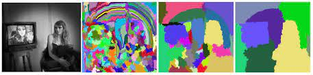
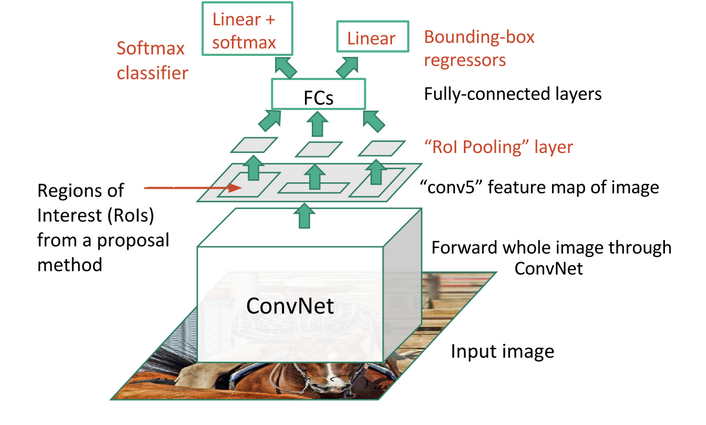

## Session Overview

During this paper discussion session, we will cover the following topics:

- The motivation behind the R-CNN architecture
- The architecture of R-CNN and its components
- The impact of the R-CNN architecture on the field of computer vision
- The shortcomings of R-CNN
- The motivation for Faster R-CNN
- The architecture Faster R-CNN and its components other than stated above

### The motivation behind the R-CNN architecture

The R-CNN paper was motivated by the need for an effective and efficient object detection framework. The authors of the paper sought to design a method that could accurately localize and classify objects within an image, addressing the limitations of existing approaches at the time.

### The architecture and its components

The R-CNN (Region-based Convolutional Neural Networks) architecture is considered a two-stage object detector because it follows a two-step process for detecting objects within an image, hence it is called Two Stage Architecture. The architecture first uses selective search to generate region proposals, which are potential bounding boxes containing objects. These region proposals are then fed into a pre-trained CNN to extract features, and finally, an SVM is used to classify the objects within the proposed regions. 

  1. Region Proposal Stage: In the first stage, the objective is to generate a set of potential bounding boxes, called region proposals, that may contain objects of interest in the input image. This is achieved using the selective search method, which efficiently generates diverse region proposals by segmenting the image based on color, texture, and intensity, and then hierarchically merging the regions. This stage narrows down the regions of interest, allowing the model to focus on the most promising regions, rather than exhaustively scanning the entire image with a sliding window.
   

   
 2. Feature Extraction and Classification Stage: 
    1. Backbone network: The backbone network in the R-CNN architecture is a pre-trained convolutional neural network (CNN) that is responsible for extracting features from the input image regions. The backbone network acts as a feature extractor, transforming the input region proposals into a fixed-size feature vector that captures the essential information about the objects within the regions. Typically, a deep CNN architecture, such as AlexNet, VGG, or ResNet, is used as the backbone network, which has been pre-trained on a large-scale image classification dataset like ImageNet.
   
    2. SVM classifier: After extracting features from the region proposals using the backbone network, an SVM (Support Vector Machine) classifier is used to determine the class of the objects within the proposed regions. The choice of an SVM classifier in the R-CNN architecture is motivated by its ability to handle high-dimensional feature spaces and provide good generalization performance. The SVM is trained on the extracted features with the corresponding ground-truth labels and learns to classify objects based on the feature vectors provided by the backbone network. The use of an SVM classifier also allows for a multi-class classification, enabling the R-CNN to detect and classify multiple object classes simultaneously.

### The impact of the R-CNN architecture on the field of computer vision

The R-CNN architecture had a significant impact on the field of computer vision, particularly in the area of object detection. It demonstrated that CNNs could be effectively utilized for detecting objects within an image and achieved state-of-the-art results on the PASCAL VOC dataset in 2013. The success of R-CNN led to the development of many subsequent architectures and methods, such as Fast R-CNN and Faster R-CNN, which further improved the efficiency and accuracy of object detection.

During the paper discussion session, we will explore the impact of the R-CNN architecture on the field of computer vision and discuss its lasting legacy.

### The shortcomings of R-CNN

1. Training complexity: The R-CNN architecture requires a multi-stage training process. The convolutional neural network (CNN) backbone must be pre-trained separately for image classification, and then fine-tuned for the object detection task. Afterward, support vector machines (SVMs) must be trained for classification using the features extracted by the CNN. Finally, a separate bounding box regression model must be trained to refine the object bounding boxes. This complex training process can be time-consuming and difficult to manage.

2. Inefficient feature extraction: In R-CNN, features are extracted independently for each region proposal using the pre-trained CNN backbone. This leads to redundant feature extraction, as the same features are computed multiple times for overlapping region proposals. This inefficiency increases the computational cost of both training and inference.

3. Slow inference time: R-CNN's inference time is relatively slow due to the independent processing of each region proposal. For an image with a large number of region proposals, this can result in a significant bottleneck, making R-CNN unsuitable for real-time applications.

4. Separate classification and regression models: R-CNN uses separate models for classification (SVMs) and bounding box regression, which increases the overall complexity and computational cost of the architecture. This separation also prevents the R-CNN from being trained end-to-end, as the various components must be trained separately.

These limitations of the R-CNN architecture motivated the development of subsequent object detection frameworks, such as Fast R-CNN and Faster R-CNN, which addressed many of these issues by introducing more efficient feature extraction, streamlined training processes, and end-to-end training capabilities.

### The motivation for Faster R-CNN
The Fast R-CNN paper was motivated by the need to address the limitations and inefficiencies of the original R-CNN architecture, specifically in terms of computation time and training complexity. The authors of the paper sought to design a more efficient and streamlined object detection framework that could offer both faster training and inference times without sacrificing accuracy.

### The architecture and its components other than stated above

The Fast R-CNN architecture introduces several key improvements over the original R-CNN:

1. Feature map sharing: Instead of extracting features for each region proposal independently, Fast R-CNN processes the entire input image with a pre-trained CNN backbone to generate a single feature map. The feature map is then used to extract features for each region proposal, significantly reducing computation time.
    

2. Region of Interest (RoI) Pooling: To handle the varying sizes of region proposals, Fast R-CNN introduces a new RoI pooling layer, which resizes the feature maps corresponding to each region proposal to a fixed size. This enables the network to use fully connected layers for further processing and classification.
   
   

3. Integrated classification and bounding box regression: Fast R-CNN integrates both the classification and bounding box regression tasks into a single network. After the RoI pooling layer, fully connected layers are used to simultaneously output class probabilities and bounding box coordinates, replacing the separate SVM classifier and regression model used in the original R-CNN.

### The shortcomings of Fast R-CNN

1. Slow training time: The Fast R-CNN architecture still requires a multi-stage training process, which can be time-consuming and difficult to manage. The training process involves pre-training the CNN backbone on a large-scale image classification dataset, fine-tuning the backbone for the object detection task, and training the RoI pooling layer and fully connected layers for classification and bounding box regression.
   
2. Slow inference time: Fast R-CNN's inference time is still relatively slow due to the independent processing of each region proposal. For an image with a large number of region proposals, this can result in a significant bottleneck, making Fast R-CNN unsuitable for real-time applications.

3. Region proposal generation: Fast R-CNN still requires region proposals to be generated using a separate algorithm, such as selective search. This can be a time-consuming process, especially for large images, and can also limit the accuracy of the object detection model.

4. Limited scalability: Fast R-CNN is limited in its scalability, as it can only process a fixed number of region proposals at a time. This can be problematic for images with a large number of region proposals, as the model may not be able to process all of them.

5. Inefficient handling of varying scales and aspect ratios: Fast R-CNN's RoI pooling layer is designed to handle the varying sizes of region proposals, but it does not handle the varying scales and aspect ratios of objects within the proposals. This can result in a mismatch between the region proposals and the objects within them, leading to reduced accuracy.

