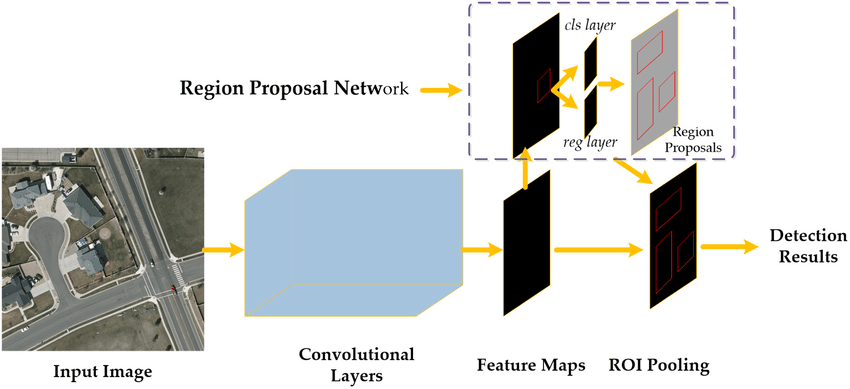

# Session Overview

During this paper discussion session, we will cover the following topics:
- The motivation behind the Faster R-CNN architecture
- Concept of Region Proposal Network (RPN)
- The difference in Architecture between Faster R-CNN and Fast R-CNN
  

## Faster RCNN

### The motivation behind the Faster R-CNN architecture

The Faster R-CNN paper was motivated by the need to address the limitations and inefficiencies of the Fast R-CNN architecture, particularly in terms of region proposal computation. The authors of the paper sought to design an even more efficient object detection framework by integrating the region proposal generation process into the network, creating a fully end-to-end trainable object detection model.

### Concept of Region Proposal Network (RPN)
Region Proposal Network (RPN): Faster R-CNN replaces the external region proposal method, such as selective search, with an integrated Region Proposal Network. The RPN is a fully convolutional neural network that is trained to generate region proposals directly from the feature map produced by the CNN backbone. This integration significantly speeds up the region proposal process, making the overall object detection pipeline more efficient.

### The difference in Architecture between Faster R-CNN and Fast R-CNN
The main difference between Faster R-CNN and Fast R-CNN is that the former uses a Region Proposal Network (RPN) to generate region proposals, while the latter uses an external region proposal method, such as selective search. The RPN is a fully convolutional neural network that is trained to generate region proposals directly from the feature map produced by the CNN backbone. This integration significantly speeds up the region proposal process, making the overall object detection pipeline more efficient.

The common parts of architecture between Faster R-CNN and Fast R-CNN are as follows:
1. Feature map sharing: Like Fast R-CNN, Faster R-CNN processes the entire input image with a pre-trained CNN backbone to generate a single feature map, which is used for both region proposal generation and feature extraction for each region proposal.

2. Region of Interest (RoI) Pooling: Faster R-CNN also employs the RoI pooling layer introduced in Fast R-CNN to resize the feature maps corresponding to each region proposal to a fixed size, enabling the network to use fully connected layers for further processing and classification.

3. Integrated classification and bounding box regression: Faster R-CNN maintains the integrated approach of Fast R-CNN for classification and bounding box regression tasks, simultaneously outputting class probabilities and bounding box coordinates from the fully connected layers.

